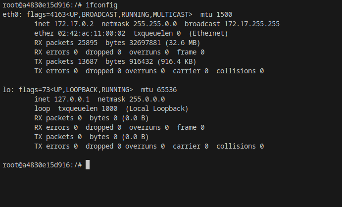

# Descarga la imagen 'ubuntu y comprueba que está en tu equipo
    con docker run -it --name practica1 ubuntu:latest bash descargamos la última imagen de ubuntu 
    con docker image comprobamos las imágenes

    Crea un contenedor sin ponerle nombre. ¿está arrancado? Obtén el nombre
    con docker run -it ubuntu bash creamos un contenedor sin nombre

    con docker ps -a nos muestra los contenedores , y estará de primero en el último de el que salimos , que será del que queremos obtener el nombre.

# Crea un contenedor con el nombre 'practica1'. ¿Como puedes acceder a él?

# con docker run -it --name ubu1 ubuntu bash creamos el contenedor
		con exit dejamos de interactuar con el contenedor

 

		con docker start ubu1 iniciamos el contenedor
		con docker exec -it ubu1 bash accedemos al contenedor

 

# Comprueba que ip tiene y si puedes hacer un ping a google.com
    con apt update actualizamos los paquetes

    con apt install net-tools instalamos el paquete net-tools

    con ifconfig comprobamos nuestra ip

    con apt install iputils-ping instalamos el paquete iputils-ping

    con ping google.com hacemos ping a google.com

# Crea un contenedor con el nombre 'practica1.2'. ¿Puedes hacer ping entre los contenedores?
		con docker run -it --name prctica1.2 ubuntu bash creamos el contenedor

		con apt update actualizamos los paquetes

		con apt install net-tools instalamos el paquete net-tools

		con ifconfig comprobamos nuestra ip y la copiamos

	en otra pestaña hacemos atach sell a la otra maquina  (ya instalamos iputils-ping) con ping 172.17.0.4 hacemos ping a la ip del otro contenedor que 
    antes ya habiamos copiado.

		
# Sal del terminal, ¿que ocurrió con el contenedor?
Se detuvo el contenedor
# ¿Cuanta memoria en el disco duro ocupaste? ¿Hay alguna herramienta de docker para calcularlo?
		con el comando docker stats podemos comprobarlo

# ¿Cuanta RAM ocupan los contenedores? Crea cuantos contenedores necesites para calcularlo.?
		

